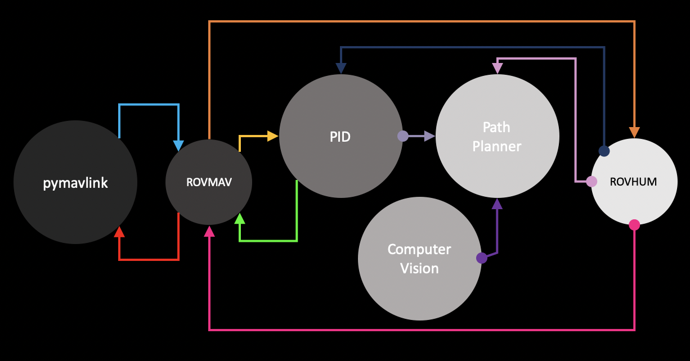
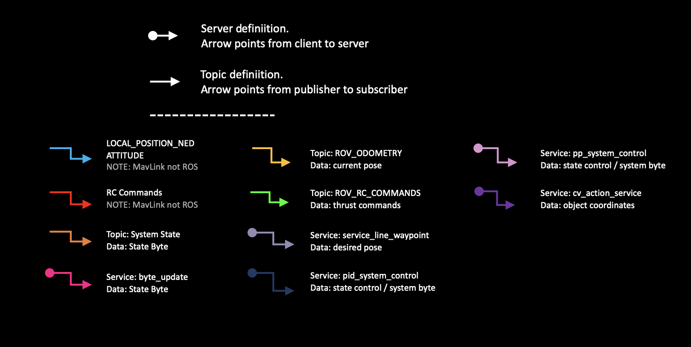
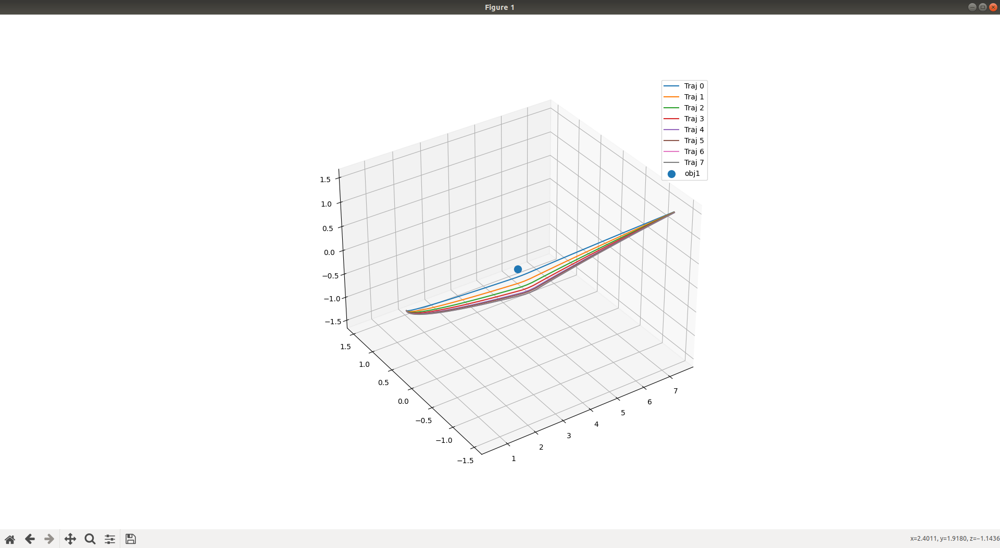
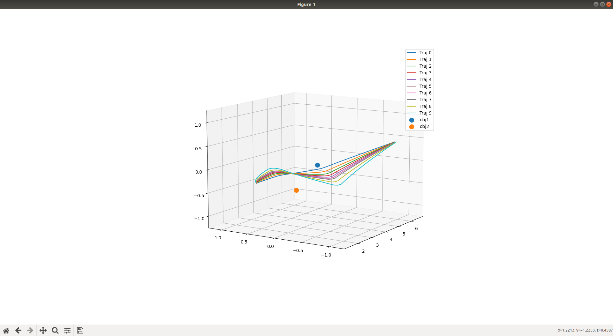
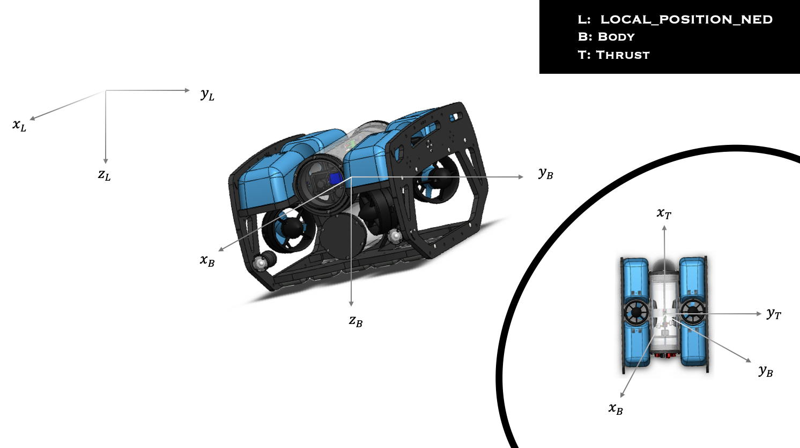
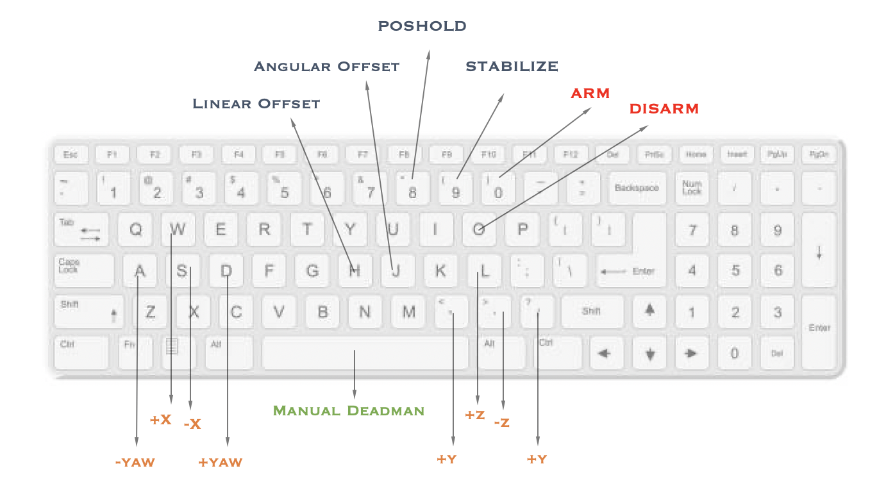

# BlueRove_Integration
Custom autonomous system integration ontop of <a href="https://bluerobotics.com/">BlueROV</a> system. 

Contents
---
<ul>
  <li>Path Planner: Modified <a href="https://faculty.cc.gatech.edu/~bboots3/files/GPMP.pdf">Gaussian Process Motion Planner</a></li>
  <li>Controller: PID controller</li>
  <li>CV System: Stereo Vision setup using two <a href="https://www.edmundoptics.com/p/BFS-PGE-23S3M-C-PoE-GigE-BlackflyR-S-Monochrome-Camera/41352?gclid=CjwKCAjwsJ6TBhAIEiwAfl4TWAuWzr_FDjUYmifoaNv6DxtEu9fxD4V9EuGcDrPQEyCPYUW3GOY6IhoC_KkQAvD_BwE">FLIR monochrome cameras</a></li>
  <li>State Controller: Handle of the robots operations and saftey.  Embedded thoughout system</li>
</ul>

Only notable thing that is still used from BlueRov is an onboard <a href="https://www.cse.sc.edu/~terejanu/files/tutorialEKF.pdf">Extended Kalman Filter (EKF)</a> fusing and filtering data for more accurate state estimations.  Additonally the mavlink protocal is used to send thrust commands to control all 8 actuators.

If you desire to dive deeper into the Mavlink Protocal I advise you to start with the below mavlink link. Additionally, you may find the following <a href="https://github.com/mavlink/mavlink/tree/master/message_definitions/v1.0">xml build files</a> to be useful when delving into its messages, commands, and parameters. However, the goal of this project was to abstract the ussage of this protocal and integrate a custom system using ROS.

Tools
---
<ul>
  <a href="https://www.ros.org/">
    <li><a href="https://www.ros.org/">ROS</a></li>
    <li><a href="https://mavlink.io/en/">Mavlink</a></li>
    <li><a href="https://www.ardusub.com/">Ardusub</a></li>
</ul>

# System Overview
  
ROS Node Communication
---

  
Each node contains a seperate system of the robot.  Additionally, there are two node for state control
  <ul>
    <li>ROVMAV</li>
    <li>ROVHUM</li>
  </ul>
  
 The state controller is essentially a control loop between ROVMAV and ROVHUM.  ROVMAV communicates with the robot and the backend of all other ROS nodes while ROVHUM communicats with the front end of each ROS node.  Based on the communication these two nodes are responisble for changing the state of the system.  
  The state of the system is defined though a system byte... well actually 7 bits instead of 8 due to 7 bits being the max in the ROS byte message. Each bit represents the following:
  
      

  System Byte 0000000 
      [0] System Healthy  
      [1] Path Planner Healthy  
      [2] PID Healthy  
      [3] ROVMAV Healthy  
      [4] MODE  
      [5] HOLD  
      [6] RESET  
      

If you would like to know more about the state controller and how it emplimented please look through the code.  You should be able to find everyhting you need from from both the two state control nodes. It is actually documented well.

Path Planner / PID / CV Communication
---
The inteligence of the system lies between the path planner, pid, and computer vision. The state controller is responisble for the interaction between all three nodes/systems.  The code is well documented on the way inwhich they communicate, but would like to showcase the performace of the path planner. 

  

Robot Cordinate Transformations
---

<ul>
  <li>LOCAL_POSITION_NED (LPN): Local linear cordinates of the robot being recieved from the EKF. </li>
  <li>Body: Parallel to LPN but its origin follows the robots body.</li>
  <li>Thrust: Shares the same origin as Body but is rotated based off ATTITUDE message coming from EKF.</li>
</ul>
  
# Running the System
To launch the system simply launch the following commands in the terminal:
<pre>
  <code>
   sudo -s
 </code>
</pre>
<pre>
  <code>
   roslaunch blue_rov_custom_integration launch.launch
 </code>
</pre>
or if tuning the pid gains:
<pre>
  <code>
   roslaunch blue_rov_custom_integration pid_test.launch
 </code>
</pre>
If testing communication with the BlueRov I advise using the pymavlink module I created.  It can be run standalon from the ROS system and is good for testing message communication, sending commands, setting parameters, or debugging the ROV.  
Note that this module contains a python module <a href="https://pypi.org/project/keyboard/">keyboard</a> witch requires sudo acces to run it.  The way I normally run the script is by:
<pre>
 <code>
   sudo -s
 </code>
</pre>
<pre>
  <code>
   pyhton3 pymavlink_interface.py
 </code>
</pre>
The keyboard module that enforces this is what allows keyboard control of the robot.  Speaking of this...

Controlling the Robot
---

