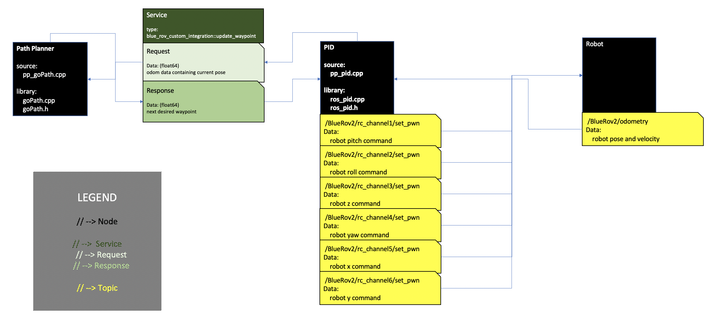

# BlueRove_Integration
Robotic frame work built with ROS specific to BlueRov Robotics

System Overview
---


Run Procedure
---
```
roscore
rosrun blue_rov_custom_integration pp_node
rosrun blue_rov_custom_integration Controller_node
```
Data Storage Procedure
---
All data gets redirected to dated file system in Storage folder:
```
rosrun blue_rov_custom_integration pp_node >> Storage/*month*/*day*/Paths/*path#.txt*
```
Data Visualization Procedure
---
Open python file found in Storage folder and insert date and *path#.txt* file choosen.
```
code PlotResults.py
```
